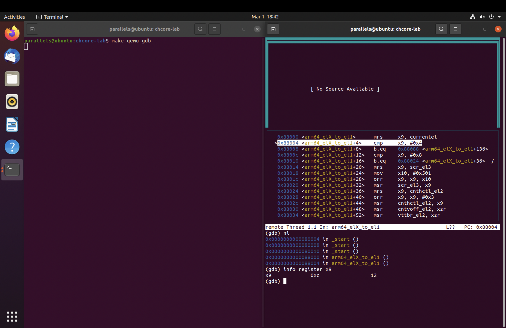
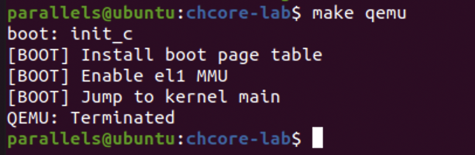
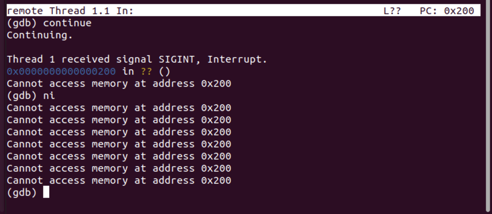

# Lab1-Report

*Wang Haotian 519021910685*

## 思考题 1：阅读`_start`函数的开头，尝试说明 ChCore 是如何让其中⼀个核⾸先进⼊初始化流程，并让其他核暂停执⾏的。

```assembly
BEGIN_FUNC(_start)
	mrs	x8, mpidr_el1
	and	x8, x8,	#0xFF
	cbz	x8, primary

	/* hang all secondary processors before we introduce smp */
	b 	.

primary:
	/* Turn to el1 from other exception levels. */
	bl 	arm64_elX_to_el1

	/* Prepare stack pointer and jump to C. */
	ldr 	x0, =boot_cpu_stack
	add 	x0, x0, #INIT_STACK_SIZE
	mov 	sp, x0

	bl 	init_c

	/* Should never be here */
	b	.
END_FUNC(_start)
```


- `mrs`指令将`mpidr_el1`的值移动到`x8`
- 接着通过`and`指令将`x8`和`#0xFF`做按位与操作，并把操作得到的结果放在`x8`寄存器中
- `cbz`指令将把`x8`和立即数0比较，若结果为0，说明是CPU0，就立即跳转到 label 为 primary 的代码执行
- 若不为0，说明不是CPU0，下一行的指令 b . 会将当前CPU挂起，等待C代码中`start_kernel(secondary_boot_flag)`执行，从而进行secondary boot

## 练习题 2：在 arm64_elX_to_el1 函数的 LAB 1 TODO 1 处填写⼀⾏汇编代码，获取 CPU 当前异常级别

```assembly
mrs x9, CurrentEL
```

使用`mrs`指令将CurrentEL寄存器中的异常级别复制到x9寄存器中，接着在GDB中输入`info register x9`获取x9中的值，即可知道当前CPU的异常级别




## 练习题 3：在 arm64_elX_to_el1 函数的 LAB 1 TODO 2 处填写⼤约 4 ⾏汇编代码，设置从 EL3 跳转到EL1 所需的 elr_el3 和 spsr_el3 寄存器值。具体地，我们需要在跳转到 EL1 时暂时屏蔽所有中断、并使⽤内核栈（ sp_el1 寄存器指定的栈指针）

```assembly
adr x9, .Ltarget
msr elr_el3, x9
mov x9, SPSR_ELX_DAIF | SPSR_ELX_EL1H
msr spsr_el3, x9
```

`adr`指令将`.Ltarget`的地址加载到x9寄存器，然后`msr`指令将返回地址（在x9中）写入elr_el3中

接着设置spsr寄存器，暂时屏蔽所有中断，使用内核栈


## 思考题 4：结合此前 ICS 课的知识，并参考 kernel.img 的反汇编（通过 aarch64-linux-gnu-objdump -S 可获得），说明为什么要在进⼊ C 函数之前设置启动栈。如果不设置，会发⽣什么？

设置函数栈是因为函数调用需要栈上的空间

如果不设置C函数栈，sp初始值为0，进行函数调用时栈向下生长，导致访问非法内存。


## 思考题 5：在实验 1 中，其实不调⽤ clear_bss 也不影响内核的执⾏，请思考不清理 .bss 段在之后的何种情况下会导致内核⽆法⼯作。

bss段默认全部为0，存放的是全局变量和静态变量。

然而当bss段不全部为0时，可能导致全局变量或静态变量带有异常的初始值，使内核无法工作


## 练习题 6：在 kernel/arch/aarch64/boot/raspi3/peripherals/uart.c 中 LAB 1 TODO 3 处实现通过 UART 输出字符串的逻辑。

```c
void uart_send_string(char *str)
{
        /* LAB 1 TODO 3 BEGIN */
        for(int i = 0;str[i] != '\0';++i) {
                early_uart_send((char)str[i]);
        }
        /* LAB 1 TODO 3 END */
}
```




## 练习题 7：在 kernel/arch/aarch64/boot/raspi3/init/tools.S 中 LAB 1 TODO 4 处填写⼀⾏汇编代码，以启⽤ MMU。

```assembly
orr		x8, x8, #SCTLR_EL1_M	// set M field to enable MMU
```

